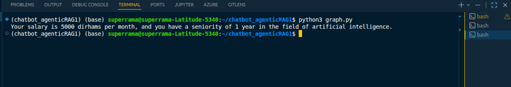

# 🤖 Agentic RAG System avec LangGraph

> **Un agent intelligent, orchestré par LangGraph, enrichi par RAG et tracé en temps réel avec LangSmith.**

[](https://www.python.org/)
[](https://www.langchain.com/)
[](https://www.langchain.com/langgraph)
[](https://openai.com/)
[](https://www.trychroma.com/)
[](https://smith.langchain.com/)

---

## 📌 Objectifs du projet

### Pourquoi ce projet ?

Dans les systèmes conversationnels modernes, un LLM seul ne suffit plus. Il faut des agents capables de **raisonner, d'agir, de chercher de l'information contextualisée**, et de **s'orchestrer intelligemment**.

Ce projet répond à ce besoin en construisant un **agent RAG (Retrieval-Augmented Generation) autonome**, capable de :

- 🔎 Récupérer des informations depuis une base de connaissances vectorielle (ChromaDB)
- 📧 Envoyer des e-mails programmatiquement via des outils LangChain
- 👤 Interroger des données métier (ex : informations sur des employés)
- 🧠 Raisonner et décider quelles actions enchaîner, grâce à LangGraph

### Problème résolu

| Problème classique | Solution apportée |
|---|---|
| LLM sans mémoire externe | Retriever RAG avec ChromaDB |
| Agent non observable | Traçage complet via LangSmith |
| Orchestration rigide | Graphe d'état dynamique avec LangGraph |
| Pas d'actions réelles | Tools LangChain (mail, données RH, docs) |

### Valeur ajoutée ✨

- Architecture **modulaire et extensible**
- Pipeline **RAG + Agent + Tools** en production-ready
- Observabilité complète des décisions de l'agent
- Développement accéléré avec LangGraph Dev Server

---

## 🧠 Architecture du projet

### Vue d'ensemble du pipeline

```
┌─────────────────────────────────────────────────────────────────┐
│                        UTILISATEUR                              │
│                    "Qui est Alice Martin ?"                     │
└──────────────────────────┬──────────────────────────────────────┘
                           │
                           ▼
┌─────────────────────────────────────────────────────────────────┐
│                    LANGGRAPH AGENT NODE                         │
│              (Orchestration par graphe d'états)                 │
│                                                                 │
│   ┌─────────────┐    ┌──────────────┐    ┌─────────────────┐   │
│   │  ReAct Loop │───▶│ Tool Calling │───▶│  State Manager  │   │
│   └─────────────┘    └──────────────┘    └─────────────────┘   │
└──────────────────────────┬──────────────────────────────────────┘
                           │
            ┌──────────────┼──────────────┐
            ▼              ▼              ▼
   ┌──────────────┐ ┌──────────────┐ ┌──────────────┐
   │get_employee_ │ │  send_mail   │ │  retriever   │
   │    info      │ │    tool      │ │    tool      │
   └──────────────┘ └──────────────┘ └──────┬───────┘
                                            │
                                            ▼
                                   ┌──────────────────┐
                                   │    CHROMADB      │
                                   │  Vector Store    │
                                   │ (OpenAI Embeds)  │
                                   └────────┬─────────┘
                                            │
                                            ▼
                                   ┌──────────────────┐
                                   │   OpenAI LLM     │
                                   │   (GPT-4 / 4o)   │
                                   └────────┬─────────┘
                                            │
                                            ▼
                                   ┌──────────────────┐
                                   │    RÉPONSE       │
                                   │  à l'utilisateur │
                                   └──────────────────┘
```

### Flux de décision de l'agent

```
START ──▶ [Agent Node] ──▶ should_continue? ──▶ [Tool Node] ──▶ [Agent Node] ──▶ END
                                  │
                                  └──▶ END (si pas de tool call)
```

---

## 🛠️ Technologies utilisées

| Technologie | Rôle | Version |
|---|---|---|
| 🐍 **Python** | Langage principal | 3.10+ |
| 🔗 **LangChain** | Framework agent + tools | 0.2+ |
| 🕸️ **LangGraph** | Orchestration par graphe d'états | Latest |
| 🧠 **OpenAI API** | LLM (GPT-4) + Embeddings | gpt-4o |
| 🗃️ **ChromaDB** | Base vectorielle pour le RAG | Latest |
| 🔭 **LangSmith** | Observabilité, tracing, studio | Latest |
| 📓 **Jupyter** | Exploration et prototypage | Latest |
| ⚡ **uvicorn** | Serveur ASGI pour LangGraph Dev | Latest |

---

## 📂 Structure du projet

```
agentic-rag-langgraph/
│
├── 📄 graph.py                  # Script principal — définition du graphe LangGraph
├── 📓 langgraph.ipynb           # Notebook exploratoire (prototypage et tests)
│
├── ⚙️ langgraph.json            # Configuration LangGraph Dev Server
├── 🔐 .env                      # Variables d'environnement (non versionné)
├── 📋 .env.example              # Template des variables d'environnement
│
├── 📦 requirements.txt          # Dépendances Python
├── 🙈 .gitignore                # Fichiers exclus du dépôt
│
├── 🗃️ chroma_db/               # Base vectorielle persistante (auto-générée)
│
└── 📸 screenshots/              # Captures d'écran pour la documentation
    ├── terminal_output.png
    ├── langgraph_dev.png
    ├── langsmith_studio.png
    └── agent_output.png
```

### Fichiers clés

**`graph.py`** — Cœur du système. Définit :
- Le graphe LangGraph avec ses nœuds et arêtes
- L'initialisation du retriever ChromaDB
- La création des tools LangChain
- La logique de l'agent ReAct

**`langgraph.ipynb`** — Notebook d'exploration pour :
- Tester les tools individuellement
- Visualiser les états du graphe
- Prototyper de nouvelles fonctionnalités

**`langgraph.json`** — Configuration pour le Dev Server :
```json
{
  "dependencies": ["."],
  "graphs": {
    "agent": "./graph.py:graph"
  }
}
```

---

## ⚙️ Installation et configuration

### 1. Cloner le projet

```bash
git clone https://github.com/Ramadiaw12/agentic-rag-langgraph.git
cd agentic-rag-langgraph
```

### 2. Créer l'environnement virtuel

```bash
# Création du venv
python -m venv venv

# Activation (Linux/macOS)
source venv/bin/activate

# Activation (Windows)
venv\Scripts\activate
```

### 3. Installer les dépendances

```bash
pip install -r pyproject.toml
```

Contenu de `requirements.txt` :

```txt
langchain
langchain-openai
langchain-community
langgraph
langsmith
chromadb
openai
python-dotenv
jupyter
uvicorn
```

### 4. Configurer les variables d'environnement

Créez un fichier `.env` à la racine du projet :

```bash
cp .env.example .env
```

Puis renseignez vos clés :

```env
# OpenAI
OPENAI_API_KEY=sk-...votre-cle-openai...

# LangSmith (Observabilité)
LANGCHAIN_TRACING_V2=true
LANGCHAIN_API_KEY=ls__...votre-cle-langsmith...
LANGCHAIN_PROJECT=agentic-rag-project
LANGCHAIN_ENDPOINT=https://api.smith.langchain.com

# Configuration optionnelle
CHROMA_PERSIST_DIR=./chroma_db
```

> ⚠️ **Important** : Ne commitez jamais votre fichier `.env`. Il est déjà inclus dans `.gitignore`.

---

## 🚀 Exécution du projet

### Option 1 — Exécuter directement le script

```bash
python graph.py
```

L'agent se lancera en mode interactif dans le terminal.

### Option 2 — Lancer le LangGraph Dev Server

```bash
langgraph dev
```

Le serveur démarre sur `http://localhost:xxxx` avec :
- 🔗 **API REST** : `http://localhost:xxxx/api/v1/`
- 🎨 **Studio UI** : `https://smith.langchain.com/studio/` (connecté en local)

### Option 3 — Explorer via le Notebook

```bash
jupyter notebook langgraph.ipynb
```

### Appeler l'API manuellement

```bash
# Lancer une conversation avec l'agent
curl -X POST http://localhost:8123/api/v1/runs \
  -H "Content-Type: application/json" \
  -d '{
    "assistant_id": "agent",
    "input": {
      "messages": [
        {"role": "user", "content": "Qui est Alice Martin dans notre équipe ?"}
      ]
    }
  }'
```

### Accéder à LangSmith Studio

1. Rendez-vous sur [smith.langchain.com](https://smith.langchain.com)
2. Connectez-vous avec votre compte
3. Sélectionnez le projet `agentic-rag-project`
4. Visualisez les traces en temps réel 🔭

---

## 🔍 Fonctionnement de l'agent

### Les Tools disponibles

#### 🧑 `get_employee_info`

Récupère les informations d'un employé depuis une base de données simulée.

```python
@tool
def get_employee_info(name: str) -> str:
    """Récupère les informations d'un employé par son nom."""
    employees = {
        "Alice Martin": {"poste": "Data Engineer", "equipe": "Data", "email": "alice@company.com"},
        "Bob Dupont":   {"poste": "ML Engineer",   "equipe": "IA",   "email": "bob@company.com"},
    }
    return json.dumps(employees.get(name, {"error": "Employé non trouvé"}))
```

#### 📧 `send_mail`

Envoie un e-mail de manière programmatique.

```python
@tool
def send_mail(to: str, subject: str, body: str) -> str:
    """Envoie un e-mail à un destinataire."""
    # Logique d'envoi d'e-mail
    return f"✅ E-mail envoyé à {to} avec le sujet '{subject}'"
```

#### 📚 `retriever_tool`

Recherche sémantique dans la base documentaire ChromaDB.

```python
retriever = vectorstore.as_retriever(search_kwargs={"k": 3})

retriever_tool = create_retriever_tool(
    retriever,
    name="search_documents",
    description="Recherche dans la base de connaissances de l'entreprise."
)
```

### Exemple d'interaction

**Question utilisateur :**
```
"Qui est Alice Martin et envoie-lui un mail pour lui souhaiter la bienvenue dans le projet IA."
```

**Raisonnement de l'agent (trace LangSmith) :**
```
[Agent] → Appel tool: get_employee_info(name="Alice Martin")
[Tool]  → {"poste": "Data Engineer", "email": "alice@company.com"}
[Agent] → Appel tool: send_mail(to="alice@company.com", subject="Bienvenue!", body="...")
[Tool]  → "✅ E-mail envoyé à rahma@company.com"
[Agent] → Réponse finale: "rahma est Data Engineer dans l'équipe Data.
           Je lui ai envoyé un e-mail de bienvenue à rahma@company.com."
```

---

## 📸 Captures d'écran

### 🖥️ Résultat dans le terminal



> *L'agent raisonne étape par étape et affiche les appels de tools dans le terminal.*

---

### 🌐 Interface LangGraph Dev Server


> *Le Dev Server expose une API REST et se connecte automatiquement à LangSmith Studio.*

---

### 🔭 Interface LangSmith Studio


> *Visualisation des traces, du graphe d'états et des appels de tools en temps réel.*

---

### 💬 Output de l'agent


> *Réponse finale de l'agent après orchestration complète du pipeline RAG + Tools.*

---

## 🧪 Tests et résultats

### Cas de test réalisés

| # | Question testée | Tools utilisés | Résultat |
|---|---|---|---|
| 1 | "Qui est Alice Martin ?" | `get_employee_info` | ✅ Infos complètes retournées |
| 2 | "Envoie un mail à Bob Dupont" | `get_employee_info` + `send_mail` | ✅ Mail simulé envoyé |
| 3 | "Quelle est la politique de congés ?" | `search_documents` (RAG) | ✅ Extrait pertinent retourné |
| 4 | "Présente Alice et envoie-lui un résumé" | Tous les tools en chaîne | ✅ Pipeline complet fonctionnel |

### Résultats observés

- ⚡ **Latence moyenne** : ~2-4 secondes par requête (GPT-4o)
- 🎯 **Pertinence RAG** : Top-3 chunks récupérés avec similarité cosinus > 0.82
- 🔁 **Chaînes multi-tools** : Jusqu'à 4 appels de tools enchaînés sans erreur
- 📊 **Traces LangSmith** : 100% des runs tracés et visualisables

---

## 💡 Améliorations possibles

### Court terme
- [ ] 🌐 **Interface web** — Intégrer un frontend React/Streamlit pour interagir via navigateur
- [ ] 💾 **Mémoire conversationnelle** — Ajouter `ConversationBufferMemory` pour les sessions longues
- [ ] 🔐 **Authentification** — Sécuriser l'API avec JWT / OAuth2

### Moyen terme
- [ ] ☁️ **Déploiement cloud** — Déployer sur AWS Lambda, GCP Cloud Run ou LangGraph Cloud
- [ ] 📊 **Dashboard d'analytics** — Tableau de bord des performances de l'agent (Grafana + LangSmith)
- [ ] 🗂️ **Multi-index RAG** — Plusieurs collections ChromaDB spécialisées par domaine

### Long terme
- [ ] 🤝 **Multi-agents** — Architecture avec agents spécialisés supervisés par un agent orchestrateur
- [ ] 🔄 **Feedback loop** — Système d'évaluation automatique et fine-tuning continu
- [ ] 🌍 **Multilinguisme** — Support natif FR/EN/AR avec détection automatique de langue

---

## 👩‍💻 Auteur

<table>
  <tr>
    <td align="center">
      <strong>DIAWANE Ramatoulaye</strong><br/>
      <em>AI & Data Engineering</em><br/>
      📧 <a href="mailto:xxx@example.com">rdiawane2001@gmail.com</a><br/>
      🔗 <a href="https://github.com/Ramadiaw12">GitHub</a> •
      <a href="https://www.linkedin.com/in/ramatoulaye-diawane/">LinkedIn</a>
    </td>
  </tr>
</table>

---

## 📄 Licence

Ce projet est distribué sous licence **MIT**.

```
MIT License — Copyright (c) 2024 DIAWANE Ramatoulaye

Permission is hereby granted, free of charge, to any person obtaining a copy
of this software and associated documentation files, to deal in the Software
without restriction, including without limitation the rights to use, copy,
modify, merge, publish, distribute, sublicense, and/or sell copies of the Software.
```

---

<div align="center">

**⭐ Si ce projet vous a été utile, n'hésitez pas à lui mettre une étoile sur GitHub !**

*Built with ❤️ using LangChain · LangGraph · LangSmith · OpenAI · ChromaDB*

</div>